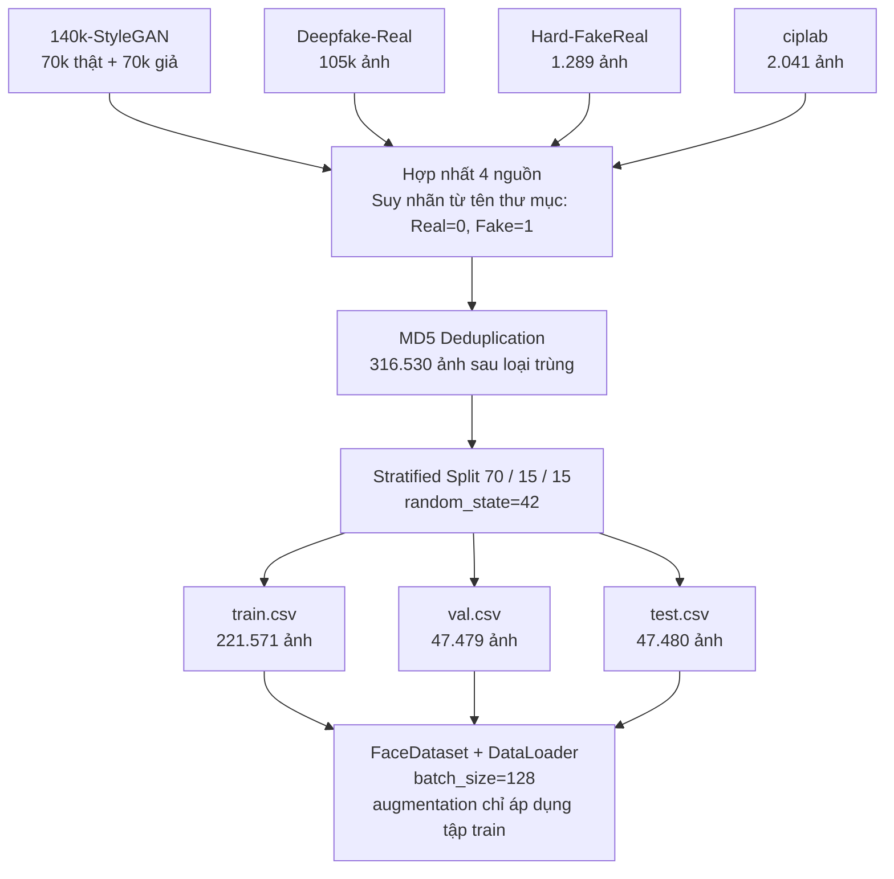

# Chương 3 — Bộ Dữ Liệu

> **Nguồn số liệu:** `reports/training_documentation.md`, `reports/eda/eda_report.md`, `data/splits/`  
> **Hình ảnh EDA:** `reports/eda/assets/`  
> **Cập nhật:** 30/05/2026

---

## 3.1 Giới Thiệu và Thu Thập Dữ Liệu

### 3.1.1 Nguồn Dữ Liệu

Tập dữ liệu của đề tài được tổng hợp từ bốn bộ dữ liệu công khai trên nền tảng Kaggle, mỗi bộ đại diện cho một phương pháp tổng hợp ảnh khuôn mặt khác nhau. Sự đa dạng này là lựa chọn có chủ đích: thay vì tối ưu hóa mô hình trên một phương pháp tổng hợp cụ thể, đề tài hướng đến khả năng tổng quát hóa thực tế qua nhiều loại ảnh giả mạo.

**Bảng 3.1 — Bốn bộ dữ liệu Kaggle sử dụng trong đề tài**

| STT | Tên bộ dữ liệu | Đường dẫn (`data/raw/`) | Quy mô gốc | Phương pháp sinh |
|-----|---------------|------------------------|------------|-----------------|
| 1 | 140k Real and Fake Faces | `140k-real-and-fake-faces/real_vs_fake/real-vs-fake` | 70.000 thật + 70.000 giả | StyleGAN2 |
| 2 | Deepfake and Real Images | `deepfake-and-real-images/Dataset` | Ảnh 256×256 | Ghép khuôn mặt (manipulation-based) |
| 3 | Fake-Vs-Real-Faces (Hard) | `hardfakevsrealfaces` | Tập nhỏ, trường hợp khó | GAN bậc cao |
| 4 | Real and Fake Face Detection | `real-and-fake-face-detection/real_and_fake_face` | Nhiều cấp độ | ciplab GAN |

*Ảnh thật trong bộ 140k-StyleGAN được lấy từ kho ảnh Flickr — đây là khuôn mặt người thật chụp trong điều kiện đời thực. Ảnh giả được tạo bởi StyleGAN2 (Karras et al., CVPR 2020), một trong những kiến trúc GAN tạo khuôn mặt chất lượng cao nhất tính đến thời điểm xuất bản.*

### 3.1.2 Quy Trình Hợp Nhất

Bốn bộ dữ liệu được hợp nhất thành một tập thống nhất qua quy trình thực thi trong `notebooks/01_dataset_preparation.ipynb`, gồm các bước tuần tự:

**Bước 1 — Suy ra nhãn từ tên thư mục:**  
Cấu trúc thư mục trong từng bộ dữ liệu mã hóa nhãn: thư mục tên `real`, `Real`, hoặc `training_real` được gán nhãn thật (Real = 0); thư mục tên `fake`, `Fake`, hoặc `training_fake` được gán nhãn giả (Fake = 1). Quy tắc ánh xạ này đảm bảo tính nhất quán khi xử lý tự động mà không cần can thiệp thủ công.

**Bước 2 — Loại bỏ trùng lặp bằng MD5:**  
Mã MD5 (một loại "vân tay số" — mỗi file ảnh sẽ có một mã duy nhất, hai file giống nhau hoàn toàn sẽ có cùng mã) được tính cho từng ảnh từ tất cả bốn nguồn. Những ảnh có cùng mã MD5 được giữ lại một bản duy nhất, loại bỏ hoàn toàn trước khi phân chia tập. Bước này đảm bảo không có ảnh nào xuất hiện nhiều lần trong tập huấn luyện do các bộ dữ liệu có phần chồng lấp.

**Bước 3 — Phân chia stratified 70/15/15:**  
Sau khi dedup, tập dữ liệu được chia theo tỷ lệ 70% huấn luyện / 15% kiểm định / 15% kiểm tra, sử dụng phân chia phân tầng (`stratified split`, `random_state=42`) để đảm bảo tỷ lệ nhãn thật/giả đồng đều trong cả ba tập. Kết quả được lưu vào ba file CSV: `data/splits/train.csv`, `data/splits/val.csv`, `data/splits/test.csv` với schema gồm hai cột: `image_path` (đường dẫn tuyệt đối, kiểu chuỗi) và `label` (chuỗi: `'Real'` = thật, `'Fake'` = giả; ánh xạ sang `Real=0`, `Fake=1` trong `FaceDataset`).

### 3.1.3 Sơ Đồ Quy Trình Hợp Nhất Dữ Liệu

Sơ đồ dưới đây trực quan hóa toàn bộ pipeline từ bốn nguồn dữ liệu thô đến tập huấn luyện/kiểm định/kiểm tra sẵn sàng cho mô hình:

### 3.1.4 Thống Kê Sau Hợp Nhất

Sau khi loại bỏ trùng lặp MD5 và phân chia, tập dữ liệu cuối cùng gồm **316.530 ảnh**, phân bổ như sau:

**Bảng 3.2 — Thống kê phân chia tập dữ liệu**

| Tập | Tổng | Real (Thật) | Fake (Giả) | Tỷ lệ Thật |
|-----|------|-------------|------------|-----------|
| Train | 221.571 | 104.819 | 116.752 | 47,3% |
| Val | 47.479 | 22.461 | 25.018 | 47,3% |
| Test | 47.480 | 22.461 | 25.019 | 47,3% |
| **Tổng cộng** | **316.530** | **149.741** | **166.789** | **47,3%** |

Tỷ lệ nhãn giữa ba tập hoàn toàn nhất quán (47,3% ảnh thật trong cả train/val/test) — xác nhận chiến lược stratified split hoạt động đúng. Tập dữ liệu có mất cân bằng lớp nhẹ (~47% thật so với ~53% giả), nhưng mức chênh lệch này (~6 điểm phần trăm) không đủ để đòi hỏi điều chỉnh trọng số lớp (`pos_weight`) trong hàm mất mát.

---

## 3.2 Phân Tích Khám Phá Dữ Liệu (EDA)

Phân tích khám phá dữ liệu được thực hiện trong `notebooks/02_eda.ipynb`, với mục tiêu xác nhận tính toàn vẹn của pipeline tiền xử lý, hiểu sâu đặc điểm phân bố ảnh, và cung cấp bằng chứng thực nghiệm cho các quyết định thiết kế mô hình. Kết quả đầy đủ được lưu tại `reports/eda/eda_report.md`.

### 3.2.1 Thống Kê Mô Tả

**Phân bố lớp theo nguồn dữ liệu:**

Bộ 140k-StyleGAN chiếm ưu thế về quy mô với 140.000 ảnh (44,2% tổng thể), phân bố hoàn hảo 50/50 giữa thật và giả. Ba bộ còn lại đóng góp phần bổ sung với quy mô nhỏ hơn và tỷ lệ thật/giả biến thiên theo thiết kế gốc của từng bộ.

> **Hình 3.1** — Biểu đồ phân bố lớp theo nguồn dữ liệu  
> Nguồn: `reports/eda/assets/eda_class_distribution.png`

**Phân bố độ phân giải:**

Phân tích trên mẫu ngẫu nhiên 5.000 ảnh cho thấy đại đa số ảnh đã ở kích thước vuông hoặc gần vuông (tỷ lệ khung hình width/height ≈ 1:1):

- **140k-StyleGAN:** toàn bộ ảnh ở kích thước 224×224 — phù hợp trực tiếp với đầu vào EfficientNet-B0 mà không cần xử lý thêm.
- **Deepfake-Real:** ảnh gốc ở kích thước 256×256; resize về 224×224 mất tối thiểu thông tin.
- **Hard-FakeReal và ciplab:** phân bố độ phân giải đa dạng hơn, nhưng vẫn chủ yếu ở tỷ lệ khung hình vuông.

Kết quả này xác nhận rằng bước resize về 224×224 bằng `albumentations.Resize` là đủ — không cần thêm viền (padding) hay cắt xén phức tạp.

> **Hình 3.2** — Phân bố độ phân giải ảnh gốc theo nguồn  
> Nguồn: `reports/eda/assets/eda_resolution.png`

### 3.2.2 Phân Tích Phân Bố Cường Độ Pixel

Thống kê cường độ pixel được tính trên mẫu tối đa 3.000 ảnh mỗi nguồn, sau khi resize về 224×224 và chuẩn hóa về khoảng [0, 1]:

**Quan sát chính:**

- Phân bố pixel **tương đối đồng nhất** giữa các nguồn trên cùng kênh màu — không có lệch miền màu sắc (domain shift) cực đoan nào được phát hiện.
- Kênh R (đỏ) có giá trị trung bình cao hơn kênh B (xanh lam) — phù hợp với đặc tính tông da của ảnh khuôn mặt người, cũng nhất quán với phân bố chuẩn ImageNet (`mean=[0.485, 0.456, 0.406]`).
- Phân bố pixel không lệch xa chuẩn ImageNet, xác nhận rằng sử dụng hệ số chuẩn hóa ImageNet (`mean=[0.485, 0.456, 0.406]`, `std=[0.229, 0.224, 0.225]`) là lựa chọn phù hợp và không cần xử lý cân bằng histogram bổ sung.

> **Hình 3.3** — Biểu đồ hộp cường độ pixel theo kênh màu R/G/B và nguồn dữ liệu  
> Nguồn: `reports/eda/assets/eda_pixel_stats.png`

### 3.2.3 Phân Tích Mẫu Đại Diện

Lưới ảnh mẫu được tạo bằng cách lấy ngẫu nhiên 4 ảnh thật và 4 ảnh giả cho mỗi nguồn (8 cột × 4 hàng), với viền xanh lá cho ảnh thật và viền đỏ cho ảnh giả. Quan sát trực quan tiết lộ đặc điểm phân biệt đặc trưng của từng nguồn:

- **140k-StyleGAN:** Ảnh giả do StyleGAN2 tạo ra rất thuyết phục, khó phân biệt bằng mắt thường. Artifact điển hình xuất hiện ở vùng tai và hoa tai (đường viền không tự nhiên, hoa tai đối xứng bất thường), vùng tóc (sợi tóc hòa lẫn vào nền), và đôi khi ở nền ảnh xung quanh khuôn mặt.
- **Deepfake-Real:** Ảnh giả là khuôn mặt được ghép hoặc biến đổi (manipulation-based) — thường nhận ra được nhờ vùng biên khuôn mặt không tự nhiên, chênh lệch màu da giữa khuôn mặt và cổ, hoặc sự không nhất quán về ánh sáng.
- **Hard-FakeReal:** Như tên gọi, bộ này được thiết kế để khó phân biệt — ảnh giả chất lượng cao, đa dạng sắc tộc và độ tuổi, không có artifact rõ ràng khi quan sát bằng mắt thường.
- **ciplab:** Ảnh giả tổng hợp từ nhiều phương pháp GAN với chất lượng biến thiên — một số có artifact vùng mắt hoặc miệng, một số gần như không thể phân biệt bằng mắt thường.

> **Hình 3.4** — Lưới ảnh mẫu: ảnh thật (viền xanh) và ảnh giả (viền đỏ) theo từng nguồn  
> Nguồn: `reports/eda/assets/eda_sample_grid.png`

### 3.2.4 Phân Tích Phổ Tần Số (FFT)

Ngoài quan sát trực quan, phân tích phổ Fourier (biến đổi tần số — một công cụ toán học để phân rã ảnh thành các thành phần dao động) cung cấp bằng chứng khách quan hơn về sự khác biệt giữa ảnh thật và giả ở mức chi tiết mà mắt thường không thể nhận ra.

**Phương pháp:** Lấy mẫu tối đa 500 ảnh mỗi lớp mỗi nguồn, chuyển về ảnh xám 224×224, tính biến đổi Fourier 2D, lấy magnitude theo thang log và dịch tần số về trung tâm. Tính phổ trung bình riêng cho ảnh thật và ảnh giả, sau đó tính hiệu (Thật − Giả).

**Quan sát chính:**

- **Phổ ảnh thật:** Năng lượng tập trung ở tần số thấp (vùng trung tâm của phổ), suy giảm tự nhiên và đều đặn ra ngoài — đặc trưng của ảnh chụp quang học thực, nơi thông tin nằm chủ yếu ở cấu trúc lớn.
- **Phổ ảnh giả:** Có thêm năng lượng dư thừa ở mức tần số trung bình và cao — dấu vết của quá trình tổng hợp AI để lại, tương tự "nốt sai" mà phần mềm ghi lại khi tạo ra hình ảnh.
- **Hiệu phổ (Thật − Giả):** Ảnh giả thiếu đi sự mịn màng tự nhiên ở mức tần số trung bình và có nhiễu bất quy tắc ở mức chi tiết cực nhỏ — đây là "dấu vân tay số" mà mô hình học để phân biệt, ngay cả khi mắt người không thể nhận ra.

Kết quả phân tích FFT lý giải vì sao kiến trúc CNN như EfficientNet-B0 — vốn học đặc trưng cục bộ ở nhiều mức độ chi tiết đồng thời — là lựa chọn phù hợp cho bài toán này. Đồng thời, kết quả này cũng gợi ý thêm bước nén ảnh nhẹ (`albumentations.ImageCompression`) vào pipeline tăng cường dữ liệu để mô hình bền vững hơn khi gặp ảnh đã bị nén qua chia sẻ mạng xã hội.

> **Hình 3.5** — Phổ Fourier trung bình của ảnh thật (trái), ảnh giả (giữa) và hiệu phổ (phải)  
> Nguồn: `reports/eda/assets/eda_fft.png`

### 3.2.5 Kiểm Tra Tính Toàn Vẹn — Không Rò Rỉ Dữ Liệu

Một bước kiểm tra quan trọng là xác nhận không có ảnh nào xuất hiện đồng thời trong nhiều hơn một tập (train/val/test) — hiện tượng được gọi là rò rỉ dữ liệu (data leakage), có thể làm phồng kết quả đánh giá một cách giả tạo nếu mô hình vô tình "nhớ" ảnh kiểm tra từ quá trình huấn luyện.

Kết quả kiểm tra giao tập đường dẫn ảnh (`image_path`):

- ✓ **Train ∩ Val:** Không có ảnh trùng.
- ✓ **Train ∩ Test:** Không có ảnh trùng.
- ✓ **Val ∩ Test:** Không có ảnh trùng.

Ba tập hoàn toàn độc lập về nội dung, xác nhận rằng kết quả đánh giá trên tập test là đáng tin cậy và phản ánh hiệu suất thực sự của mô hình trên dữ liệu chưa thấy.

---

## 3.3 Nhận Xét Chất Lượng Bộ Dữ Liệu

### 3.3.1 Quy Mô và Cấu Trúc

Với 316.530 ảnh sau dedup và phân chia stratified, tập dữ liệu đạt quy mô đủ lớn để huấn luyện mô hình deep learning với độ ổn định cao. Tập train gồm 221.571 ảnh — lớn hơn đáng kể so với các nghiên cứu phát hiện deepfake thường dùng tập huấn luyện dưới 100.000 ảnh. Tập test độc lập 47.480 ảnh cho phép ước lượng metric với sai số thống kê nhỏ.

Mất cân bằng lớp nhẹ (~47% thật, ~53% giả) không gây vấn đề thực tiễn và không đòi hỏi điều chỉnh `pos_weight` trong hàm mất mát.

### 3.3.2 Đa Dạng Nguồn — Thách Thức và Cơ Hội

Điểm mạnh nổi bật nhất của tập dữ liệu là tính đa dạng nguồn sinh: bốn phương pháp tổng hợp (StyleGAN2, manipulation-based, GAN bậc cao, ciplab GAN) để lại các loại artifact hoàn toàn khác nhau. Sự đa dạng này buộc mô hình học các đặc trưng phổ quát về sự khác biệt thật/giả, thay vì phụ thuộc vào artifact đặc trưng của một generator cụ thể.

Tuy nhiên, bộ 140k-StyleGAN chiếm tới 44,2% tổng thể, đặt ra nguy cơ mô hình học quá mức theo phong cách của StyleGAN2. Chiến lược lấy mẫu cân bằng theo nguồn là biện pháp có thể cân nhắc trong các thử nghiệm tương lai.

### 3.3.3 Thách Thức Kỹ Thuật

**Domain shift giữa các nguồn:** Mỗi bộ dữ liệu có đặc điểm phân bố độ phân giải, màu sắc và phong cách chụp ảnh khác nhau, dẫn đến lệch miền dữ liệu giữa các nguồn. Kết quả cross-generator evaluation (Phần 5.4.2) cho thấy điều này ảnh hưởng đáng kể đến khả năng tổng quát hóa — đặc biệt trên bộ ciplab, nơi mô hình suy giảm hiệu suất đột ngột khi không có ảnh từ nguồn này trong tập huấn luyện.

**Bộ Hard-FakeReal — khó phân loại:** Bộ dữ liệu này được thiết kế đặc biệt để thách thức các mô hình phân loại — ảnh giả có chất lượng cao, không có artifact rõ ràng khi quan sát bằng mắt thường. Kết quả cross-generator trên bộ này (Accuracy 90,77%, Phần 5.4.2) thấp hơn các bộ khác, phù hợp với mức độ khó này.

**Rủi ro rò rỉ dữ liệu đã được loại bỏ:** Bước dedup MD5 và kiểm tra giao tập xác nhận pipeline tiền xử lý sạch và đáng tin cậy.

### 3.3.4 Giới Hạn Về Phạm Vi

Tập dữ liệu không bao gồm ảnh từ các mô hình khuếch tán thế hệ mới (Stable Diffusion, Midjourney, DALL-E 3) — các phương pháp này tạo ra artifact hoàn toàn khác về cấu trúc tần số so với GAN. Đây là giới hạn quan trọng cần lưu ý khi suy luận về khả năng tổng quát hóa của mô hình sang các nguồn sinh ảnh chưa từng thấy trong huấn luyện (xem thêm Chương 7 — Hướng Phát Triển).
