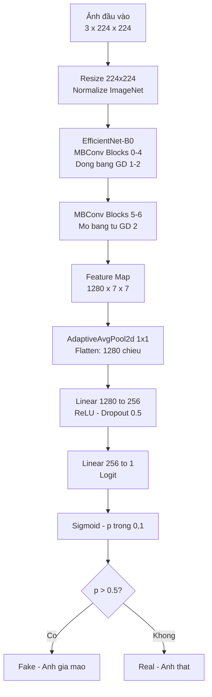
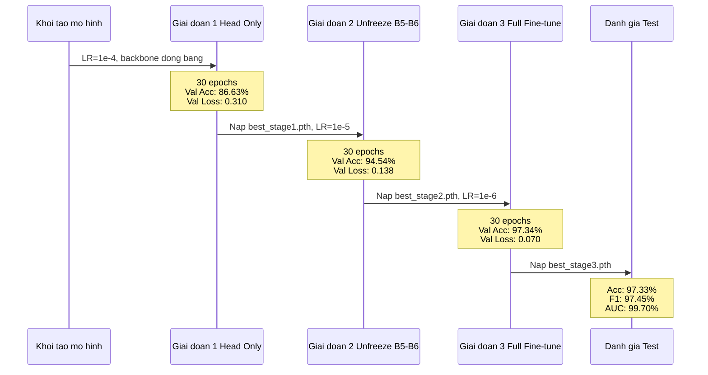

# Chương 4 — Phương Pháp Đề Xuất

> **Nguồn tham chiếu:** `src/model.py`, `src/dataset.py`, `configs/train_config.yaml`, `reports/training_documentation.md`  
> **Cập nhật:** 28/05/2026

---

## 4.1 Mô Hình

### 4.1.1 EfficientNet-B0 Backbone

Kiến trúc backbone được chọn là EfficientNet-B0 [CITE: Tan & Le, 2019], nạp từ thư viện timm với trọng số đã được tiền huấn luyện trên tập ImageNet:

```python
timm.create_model("efficientnet_b0", pretrained=True, num_classes=0, global_pool="")
```

Tham số `num_classes=0` loại bỏ classifier mặc định của timm, biến backbone thành bộ trích xuất đặc trưng thuần túy với đầu ra là feature map kích thước (B, 1280, 7, 7) với ảnh đầu vào 224×224.

**Lý do chọn EfficientNet-B0:**

EfficientNet được xây dựng trên nguyên tắc *compound scaling* — scale đồng thời độ sâu (depth), độ rộng (width) và độ phân giải (resolution) của mạng theo một hệ số tỷ lệ thống nhất, thay vì chỉ scale một chiều như các kiến trúc trước đó. Cách tiếp cận này cho phép đạt độ chính xác tương đương ResNet-50 với số lượng tham số ít hơn khoảng 5 lần (~5,3 triệu so với ~25 triệu tham số). Ưu thế này có ý nghĩa thực tiễn quan trọng:

- Huấn luyện nhanh hơn và tiêu thụ ít VRAM hơn trên cùng phần cứng.
- Ít nguy cơ overfitting hơn khi làm việc với tập dữ liệu đa domain có phân bố không đồng nhất.
- Pretrained trên ImageNet cung cấp bộ đặc trưng nền chất lượng cao — đặc biệt quan trọng cho phân tích chi tiết ảnh khuôn mặt.

Bảng 4.1 tóm tắt so sánh giữa EfficientNet-B0 và các kiến trúc phổ biến khác.

**Bảng 4.1 — So sánh kiến trúc backbone**

| Kiến trúc | Số tham số | Top-1 Accuracy (ImageNet) | Ghi chú |
|---|---|---|---|
| EfficientNet-B0 | ~5,3M | 77,1% | Lựa chọn của đề tài |
| ResNet-50 | ~25,6M | 76,2% | ~5× tham số hơn |
| VGG-16 | ~138M | 74,4% | Quá nặng cho fine-tuning |
| ViT-B/16 | ~86M | 81,8% | Cần lượng dữ liệu lớn hơn |

---

### 4.1.2 Custom Classification Head

Sau backbone, một phần đầu phân loại tùy chỉnh được gắn vào để thực hiện bài toán phân loại nhị phân:

```
Feature Map (B, 1280, 7, 7)
    → AdaptiveAvgPool2d(1,1)     # (B, 1280, 1, 1)
    → Flatten                    # (B, 1280)
    → Linear(1280 → 256)
    → ReLU
    → Dropout(0.5)
    → Linear(256 → 1)
    → Logit (B, 1)
```

**Bảng 4.2 — Thiết kế và lý do từng thành phần trong classification head**

| Thành phần | Cấu hình | Lý do thiết kế |
|---|---|---|
| AdaptiveAvgPool2d | Output (1,1) | Tổng hợp thông tin không gian từ toàn bộ feature map |
| Linear (đầu tiên) | 1280 → 256 | Chiều rộng 256 đủ để học ranh giới phân loại Real/Fake |
| Dropout | p = 0,5 | Ngăn overfitting — ảnh giả có artifact cụ thể dễ bị "học thuộc" |
| Linear (đầu ra) | 256 → 1 | Một logit duy nhất cho phân loại nhị phân |

**Hàm mất mát:** `BCEWithLogitsLoss` — kết hợp sigmoid và binary cross-entropy trong một hàm duy nhất theo công thức:

$$\mathcal{L}(x, y) = -\left[ y \cdot \log\sigma(x) + (1-y) \cdot \log(1 - \sigma(x)) \right]$$

trong đó $x$ là logit đầu ra, $y \in \{0, 1\}$ là nhãn thật ($0$ = thật, $1$ = giả), và $\sigma(\cdot)$ là hàm sigmoid. Cách triển khai này ổn định số học hơn so với việc áp dụng `sigmoid()` riêng biệt rồi tính `BCELoss`, vì tránh được vấn đề tràn số dấu phẩy động khi logit có giá trị tuyệt đối lớn. Sigmoid **không** được áp dụng trước khi tính mất mát trong quá trình huấn luyện, chỉ áp dụng khi inference để chuyển logit thành xác suất.

---

### 4.1.3 Chiến Lược Huấn Luyện 3 Giai Đoạn (Progressive Unfreezing)

Chiến lược huấn luyện dựa trên nguyên tắc *discriminative fine-tuning*: các lớp gần đầu vào của backbone đã học được đặc trưng hình học phổ quát tốt từ ImageNet nên cần learning rate thấp và ít điều chỉnh; các lớp cao hơn và phần đầu phân loại cần học từ đầu hoặc thích nghi mạnh hơn với domain khuôn mặt. Phương pháp mở băng dần (progressive unfreezing) giảm thiểu nguy cơ *catastrophic forgetting* — hiện tượng mô hình mất đi đặc trưng đã học khi bị cập nhật trọng số với learning rate cao.

**Bảng 4.3 — Thông số chi tiết 3 giai đoạn huấn luyện**

| Giai đoạn | Tên | Lớp được huấn luyện | Learning Rate | Max Epochs | Điều kiện dừng |
|---|---|---|---|---|---|
| 1 | Freeze Backbone | Head only (backbone đóng băng) | 1×10⁻⁴ | 30 | EarlyStopping patience=5 |
| 2 | Unfreeze Top | Head + EfficientNet blocks 5–6 | 1×10⁻⁵ | 30 | EarlyStopping patience=5 |
| 3 | Unfreeze All | Toàn bộ mô hình | 1×10⁻⁶ | 30 | EarlyStopping + ReduceLROnPlateau |

*Ghi chú: EfficientNet-B0 có 7 MBConv block (đánh số 0–6). Giai đoạn 2 chỉ mở băng blocks 5 và 6 — hai block cuối cùng học đặc trưng bậc cao nhất.*

**Luồng thực thi:**

Toàn bộ quy trình 3 giai đoạn được thực thi tuần tự trong một lần chạy `scripts/run_train.py`:

1. **Giai đoạn 1:** Khởi tạo head ngẫu nhiên, đóng băng backbone → huấn luyện đến epoch 30.
2. Nạp checkpoint tốt nhất của Giai đoạn 1 → **Giai đoạn 2:** Mở băng blocks 5–6 → huấn luyện đến epoch 30.
3. Nạp checkpoint tốt nhất của Giai đoạn 2 → **Giai đoạn 3:** Mở băng toàn bộ → huấn luyện đến epoch 30.
4. Nạp checkpoint tốt nhất của Giai đoạn 3 → Đánh giá trên tập test độc lập.

**Kết quả quá trình huấn luyện:**

| Giai đoạn | Epochs chạy | Val Loss tốt nhất | Val Accuracy | Kích thước checkpoint |
|---|---|---|---|---|
| 1 | 30/30 | 0,3103 | 86,63% | 20,3 MB |
| 2 | 30/30 | 0,1383 | 94,54% | 26,0 MB |
| 3 | 30/30 | 0,0699 | 97,34% | 52,5 MB |

Đáng chú ý, cả ba giai đoạn đều chạy đủ 30 epochs mà EarlyStopping không kích hoạt — cho thấy mô hình tiếp tục cải thiện đến epoch cuối của mỗi giai đoạn. Val loss giảm liên tục 0,310 → 0,138 → 0,070, tương ứng mức giảm ~77% từ Giai đoạn 1 đến Giai đoạn 3.

**Các callback điều khiển huấn luyện:**

| Callback | Tham số | Tác dụng |
|---|---|---|
| EarlyStopping | patience=5, monitor=val\_loss | Dừng sớm nếu val\_loss không cải thiện sau 5 epoch liên tiếp |
| ReduceLROnPlateau | patience=3, factor=0,3, min\_lr=1×10⁻⁷ | Giảm learning rate xuống còn 30% khi val\_loss bão hòa 3 epoch |
| ModelCheckpoint | monitor=val\_loss, save\_top\_k=1 | Lưu checkpoint có val\_loss thấp nhất mỗi giai đoạn |

**Định dạng checkpoint:**

```python
{
    "epoch":                int,    # Số epoch tại thời điểm lưu
    "model_state_dict":     dict,   # Trọng số mô hình
    "optimizer_state_dict": dict,   # Trạng thái optimizer
    "val_loss":             float,  # Validation loss tốt nhất
    "val_acc":              float,  # Validation accuracy tương ứng
    "config":               dict    # Cấu hình tại thời điểm huấn luyện
}
```

---

### 4.1.4 Sơ Đồ Kiến Trúc Tổng Thể

Sơ đồ luồng dữ liệu qua toàn bộ mô hình từ ảnh đầu vào đến quyết định phân loại:



### 4.1.5 Sơ Đồ Chiến Lược Huấn Luyện 3 Giai Đoạn

Sequence diagram mô tả luồng huấn luyện progressive unfreezing:



## 4.2 Pipeline Tiền Xử Lý và Tăng Cường Dữ Liệu

### 4.2.1 Tiền Xử Lý Cơ Bản (Áp Dụng Cho Cả Ba Tập)

Mọi ảnh đầu vào đều trải qua hai bước tiền xử lý cố định trước khi đưa vào mô hình:

**Bước 1 — Resize về 224×224:**  
Kích thước 224×224 là kích thước đầu vào mặc định của EfficientNet-B0 theo thư viện timm. Phân tích EDA xác nhận hầu hết ảnh trong tập dữ liệu đã ở kích thước vuông (tỷ lệ khung hình ≈ 1:1), do đó resize không gây biến dạng hình học đáng kể.

**Bước 2 — Chuẩn hóa theo chuẩn ImageNet:**  
```
Mean: [0,485, 0,456, 0,406]   (kênh R, G, B)
Std:  [0,229, 0,224, 0,225]   (kênh R, G, B)
```
Backbone EfficientNet-B0 được tiền huấn luyện trên ImageNet với phân bố chuẩn hóa này, nên việc dùng cùng giá trị đảm bảo đặc trưng trích xuất từ backbone là có ý nghĩa ngay từ đầu quá trình fine-tuning. Phân tích EDA (Phần 3.2.2) xác nhận phân bố pixel của tập dữ liệu không lệch xa chuẩn ImageNet, làm căn cứ cho quyết định này.

### 4.2.2 Tăng Cường Dữ Liệu (Chỉ Áp Dụng Cho Tập Huấn Luyện)

Tăng cường dữ liệu (data augmentation) được thực hiện bằng thư viện albumentations, chỉ áp dụng trong lúc huấn luyện để tập val và test đánh giá trung thực trên dữ liệu gốc.

**Bảng 4.4 — Các phép biến đổi tăng cường dữ liệu**

| Phép biến đổi | Tham số | Xác suất áp dụng | Mục đích |
|---|---|---|---|
| HorizontalFlip | — | 0,5 | Mô phỏng đối xứng gương — khuôn mặt người nhìn từ hai hướng |
| RandomBrightnessContrast | brightness\_limit=0,2, contrast\_limit=0,2 | 0,5 | Mô phỏng điều kiện ánh sáng thay đổi |
| ShiftScaleRotate | shift=0,1, scale=0,1, rotate=15° | 0,5 | Mô phỏng góc chụp và tư thế đầu thay đổi nhẹ |
| CoarseDropout | max\_holes=8, kích thước 16×16 px | 0,3 | Ngăn mô hình phụ thuộc vào đặc trưng cục bộ cố định |

*Tập val/test:* Chỉ resize 224×224 và chuẩn hóa — không áp dụng bất kỳ phép biến đổi ngẫu nhiên nào để đảm bảo đánh giá tái lập và không thiên vị.

---

### 4.2.3 Lớp FaceDataset và DataLoader

Lớp `FaceDataset` (định nghĩa tại `src/dataset.py`) kế thừa `torch.utils.data.Dataset` và thực hiện:

- Đọc file CSV phân chia (`image_path`, `label`), ánh xạ nhãn chuỗi sang số nguyên (Real → 0, Fake → 1).
- Nạp ảnh bằng Pillow, chuyển sang mảng NumPy RGB trước khi áp dụng albumentations.
- Trả về cặp `(image_tensor, label_tensor)` với `label_tensor` kiểu `torch.float32` phù hợp với `BCEWithLogitsLoss`.

`DataLoader` được cấu hình như sau:

| Tham số | Giá trị | Lý do |
|---|---|---|
| batch\_size | 128 | Vừa VRAM 12GB khi dùng mixed precision FP16 |
| shuffle | True (train) / False (val, test) | Ngẫu nhiên hóa thứ tự mẫu khi huấn luyện |
| num\_workers | 2 | Cân bằng tốc độ nạp dữ liệu và tiêu thụ RAM |
| pin\_memory | True | Tăng tốc chuyển dữ liệu từ RAM sang VRAM |

---

## 4.3 Tái Lập Kết Quả (Reproducibility)

Toàn bộ quá trình được cố định seed để đảm bảo kết quả có thể tái lập:

```python
import random, numpy as np, torch
random.seed(42)
np.random.seed(42)
torch.manual_seed(42)
torch.cuda.manual_seed_all(42)
torch.backends.cudnn.deterministic = True
torch.backends.cudnn.benchmark = False
```

Phân chia dữ liệu sử dụng `random_state=42` trong `sklearn.model_selection.train_test_split`.

---

## 4.4 Môi Trường Huấn Luyện và Công Nghệ Sử Dụng

Mô hình được huấn luyện trong khoảng 17 giờ trên phần cứng dưới đây.

**Bảng 4.5 — Phần cứng sử dụng**

| Thành phần | Thông số |
|---|---|
| CPU | AMD Ryzen 5 7500F 6-Core |
| GPU | NVIDIA GeForce RTX 5070 |
| VRAM | 12,82 GB |
| CUDA Compute Capability | 12.0 (Blackwell) |
| CUDA | 13.0 |

**Mixed-precision training (FP16):** Được bật bằng `torch.cuda.amp.autocast()` kết hợp với `torch.cuda.amp.GradScaler`, giảm mức tiêu thụ VRAM khoảng 40% và tăng tốc huấn luyện ~1,5–2 lần trên RTX 5070 nhờ tensor cores.

**Bảng 4.6 — Các thư viện và phiên bản sử dụng**

| Loại | Thư viện | Phiên bản | Mục đích |
|---|---|---|---|
| Framework | PyTorch | 2.12.0+cu130 | Deep learning — huấn luyện và inference |
| Model library | timm | 1.0.27 | EfficientNet-B0 với trọng số pretrained |
| Augmentation | albumentations | 2.0.8 | Tăng cường dữ liệu train |
| Metrics | scikit-learn | 1.8.0 | Tính Accuracy/Precision/Recall/F1/AUC-ROC |
| Visualization | matplotlib | ≥ 3.8 | Confusion matrix, ROC curve, training curves |
| Data | pandas | ≥ 2.1 | Đọc và xử lý file CSV |
| Config | PyYAML | — | Nạp siêu tham số từ `configs/train_config.yaml` |
| Ngôn ngữ | Python | 3.12 | — |

Toàn bộ siêu tham số được quản lý tập trung tại `configs/train_config.yaml` — không có giá trị nào được hardcode trong mã nguồn, đảm bảo khả năng tái cấu hình và tái lập thực nghiệm.
