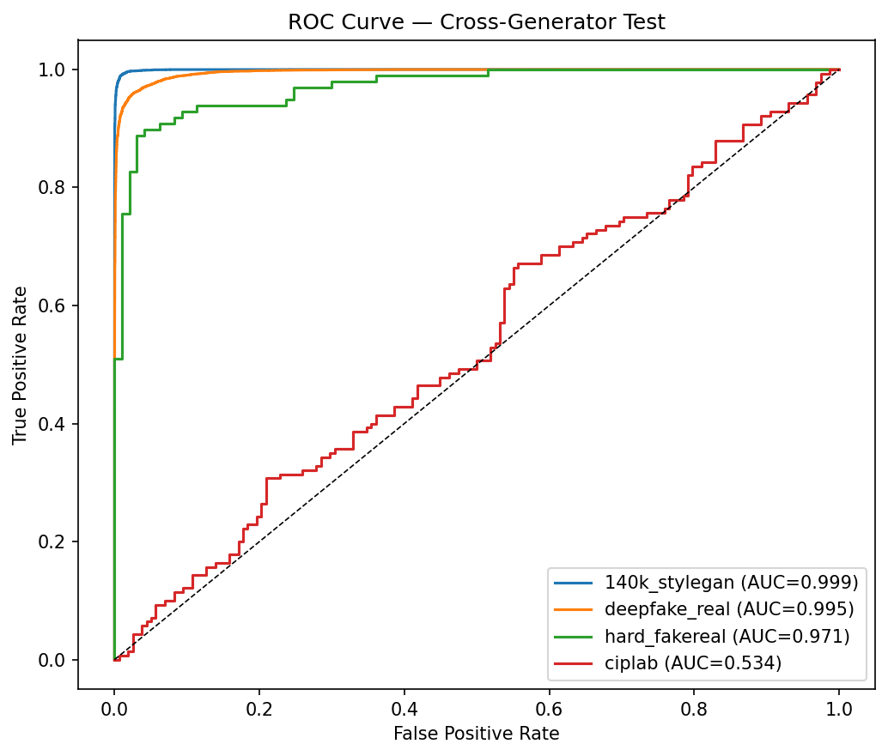
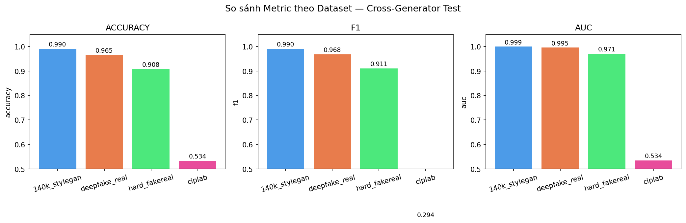
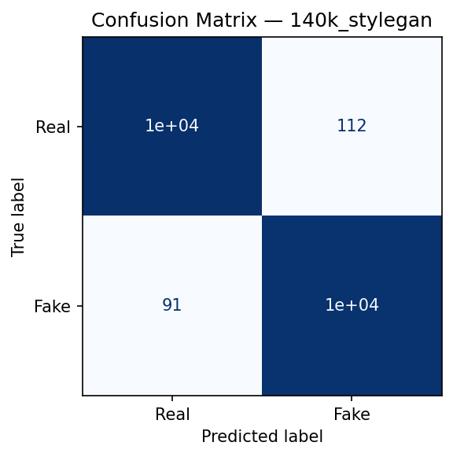
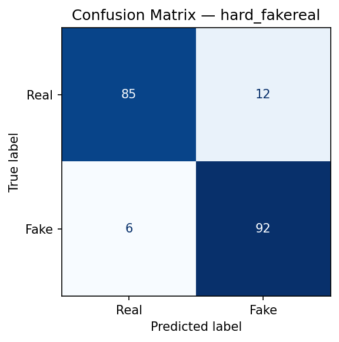
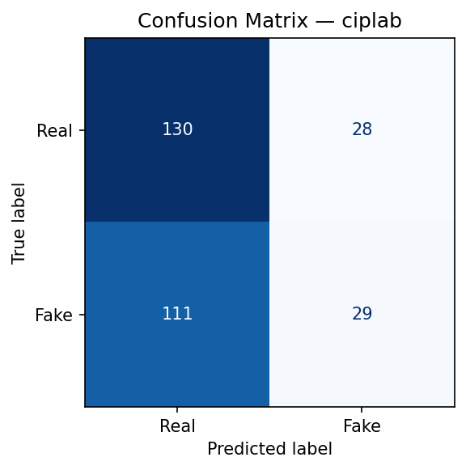
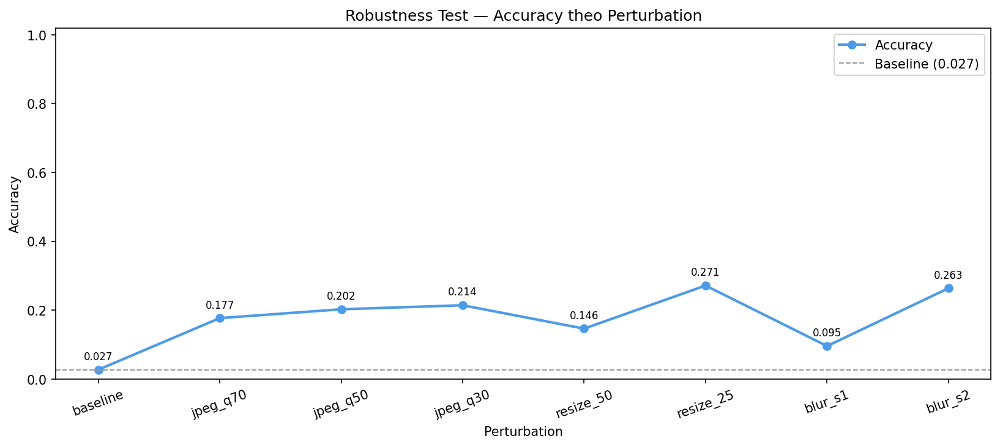
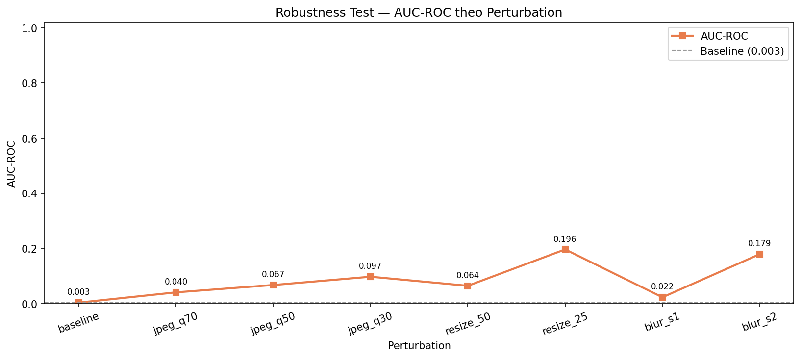
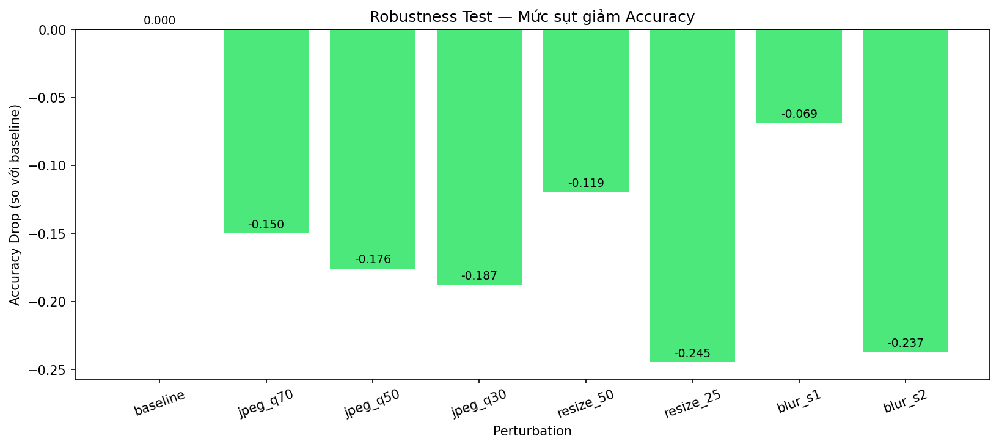

# Báo cáo Kiểm thử — DS200.F21.CN2

> **Ngày thực hiện:** [INSERT: DD/MM/YYYY]
> **Checkpoint sử dụng:** `artifacts/checkpoints/best_stage3.pth`
> &nbsp;&nbsp;&nbsp;&nbsp;*(epoch 30, val\_loss = 0.0699, val\_acc = 0.9734)*
> **Tập kiểm thử:** `data/splits/test.csv` — [INSERT: N] mẫu
> **Thiết bị:** [INSERT: CPU / GPU model]
> **Thư viện:** torch [INSERT], timm [INSERT]

---

## Mục lục

1. [Kiểm thử 1 — Cross-Generator](#1-kiểm-thử-1--cross-generator)
   - [1.1 Mục đích và phạm vi](#11-mục-đích-và-phạm-vi)
   - [1.2 Phương pháp thực hiện](#12-phương-pháp-thực-hiện)
   - [1.3 Dữ liệu kiểm thử](#13-dữ-liệu-kiểm-thử)
   - [1.4 Ý nghĩa các chỉ số đánh giá](#14-ý-nghĩa-các-chỉ-số-đánh-giá)
   - [1.5 Kết quả](#15-kết-quả)
   - [1.6 Nhận xét và thảo luận](#16-nhận-xét-và-thảo-luận)
2. [Kiểm thử 2 — Robustness](#2-kiểm-thử-2--robustness)
   - [2.1 Mục đích và phạm vi](#21-mục-đích-và-phạm-vi)
   - [2.2 Phương pháp thực hiện](#22-phương-pháp-thực-hiện)
   - [2.3 Kết quả](#23-kết-quả)
   - [2.4 Nhận xét và thảo luận](#24-nhận-xét-và-thảo-luận)
3. [Kết luận chung](#3-kết-luận-chung)

---

## 1. Kiểm thử 1 — Cross-Generator

**Notebook:** `notebooks/03_cross_generator_test.ipynb`
**Kết quả lưu tại:** `tests/cross_generator/`

### 1.1 Mục đích và phạm vi

Kiểm thử Cross-Generator nhằm trả lời câu hỏi: **mô hình có khả năng tổng quát hóa sang các loại ảnh giả khác nhau hay không?** Mỗi phương pháp tạo ảnh giả (GAN-based, face-swap, nguồn hỗn hợp…) để lại những dấu hiệu thị giác đặc trưng riêng biệt — gọi là *artifact* (lỗi thị giác nhỏ). Nếu mô hình chỉ học thuộc một loại artifact cụ thể thay vì học được đặc trưng chung của ảnh giả, hiệu suất sẽ sụt giảm rõ rệt khi gặp nguồn dữ liệu mới.

Kiểm thử này đánh giá mô hình trên **4 nhóm dữ liệu riêng biệt**, mỗi nhóm tương ứng với một nguồn/phương pháp tạo ảnh giả khác nhau, từ đó xác định điểm mạnh và điểm yếu của mô hình đối với từng loại ảnh giả.

### 1.2 Phương pháp thực hiện

#### Thiết kế thực nghiệm

Thực nghiệm sử dụng **một checkpoint duy nhất** (best\_stage3) cho toàn bộ quá trình đánh giá. Quy trình như sau:

```
checkpoint (best_stage3.pth)
        ↓
   Nạp test.csv
        ↓
   Phân loại ảnh theo nguồn dataset (dựa vào đường dẫn image_path)
        ↓
   ┌─────────────────────────────────────────────────────────────┐
   │  image_path chứa "140k-real-and-fake-faces"  → nhóm CG-1   │
   │  image_path chứa "deepfake-and-real-images"  → nhóm CG-2   │
   │  image_path chứa "hardfakevsrealfaces"        → nhóm CG-3   │
   │  image_path chứa "real-and-fake-face-detection" → nhóm CG-4 │
   └─────────────────────────────────────────────────────────────┘
        ↓
   Chạy inference riêng cho từng nhóm
        ↓
   Tính metric độc lập cho từng nhóm
```

#### Bốn nhóm đánh giá

| Ký hiệu | Dataset | Phương pháp tạo ảnh giả | Đặc điểm |
|---------|---------|--------------------------|-----------|
| CG-1 | 140k-StyleGAN | GAN-based (StyleGAN2) | Ảnh giả rất chân thực, không có người thật tương ứng |
| CG-2 | Deepfake-Real | Manipulation-based (face-swap) | Hoán đổi khuôn mặt, kích thước 256×256 |
| CG-3 | Hard-FakeReal | Hỗn hợp, khó phân loại | Tập dữ liệu nhỏ, ranh giới thật/giả mờ |
| CG-4 | ciplab | Nguồn hỗn hợp | Đa dạng nguồn, quy mô nhỏ |

#### Lưu ý về phương pháp — khác biệt so với Leave-One-Dataset-Out chuẩn

> **Phương pháp Leave-One-Dataset-Out (LODO) chuẩn** yêu cầu retrain mô hình 4 lần — mỗi lần loại bỏ một dataset khỏi tập train và đánh giá trên dataset bị loại bỏ đó. Phương pháp này cho phép đo lường *thực sự* khả năng tổng quát hóa sang dữ liệu chưa từng thấy trong quá trình huấn luyện.
>
> **Phương pháp áp dụng trong báo cáo này** khác ở chỗ: mô hình được huấn luyện trên **toàn bộ 4 dataset** (bao gồm cả phần test của 4 nguồn này), sau đó đánh giá trên **tập test riêng rẽ của từng nguồn**. Đây là phân tích *per-source performance* — không phải kiểm thử generalization theo nghĩa chuẩn.
>
> **Hạn chế cần nêu trong báo cáo:** Do mô hình đã từng thấy dữ liệu từ cả 4 nguồn trong quá trình train, kết quả không phản ánh khả năng tổng quát hóa sang *nguồn hoàn toàn mới*. Tuy nhiên, sự chênh lệch metric giữa các nhóm vẫn cung cấp thông tin có giá trị về *độ khó* của từng loại fake và *mức độ phụ thuộc* của mô hình vào đặc trưng riêng của từng nguồn.
>
> *Trong phần Experiments của báo cáo học thuật, cần ghi rõ: "Do mô hình được huấn luyện trên toàn bộ 4 dataset, kiểm thử cross-generator được thực hiện bằng cách phân tích hiệu suất riêng biệt trên từng tập con trong test set, thay vì theo phương pháp Leave-One-Dataset-Out chuẩn."*

### 1.3 Dữ liệu kiểm thử

Tập `test.csv` là 15% dữ liệu được tách ra theo phương pháp stratified sampling (lấy mẫu phân tầng để giữ nguyên tỷ lệ thật/giả) với `random_state=42`.

| Nhóm | Số mẫu | Số ảnh thật | Số ảnh giả |
|------|--------|-------------|------------|
| CG-1 (140k-StyleGAN) | [INSERT] | [INSERT] | [INSERT] |
| CG-2 (Deepfake-Real) | [INSERT] | [INSERT] | [INSERT] |
| CG-3 (Hard-FakeReal) | [INSERT] | [INSERT] | [INSERT] |
| CG-4 (ciplab) | [INSERT] | [INSERT] | [INSERT] |
| **Tổng** | **[INSERT]** | **[INSERT]** | **[INSERT]** |

### 1.4 Ý nghĩa các chỉ số đánh giá

Bài toán phân loại ảnh thật/giả là bài toán phân loại nhị phân. Các chỉ số đánh giá được tính dựa trên ma trận nhầm lẫn (confusion matrix), trong đó lớp dương tính (Positive) là ảnh **Fake** và lớp âm tính (Negative) là ảnh **Real**.

**Accuracy (Độ chính xác tổng thể)**
$$\text{Accuracy} = \frac{TP + TN}{TP + TN + FP + FN}$$
Tỉ lệ mẫu được phân loại đúng trên tổng số mẫu. Chỉ số này phản ánh hiệu suất tổng quan nhưng có thể gây hiểu nhầm khi dữ liệu mất cân bằng.

**Precision (Độ chính xác dự đoán dương)**
$$\text{Precision} = \frac{TP}{TP + FP}$$
Trong số những ảnh mô hình *dự đoán là Fake*, bao nhiêu phần trăm thực sự là Fake. Precision cao đồng nghĩa mô hình ít "oan" ảnh thật thành ảnh giả.

**Recall (Độ bao phủ — hay Sensitivity)**
$$\text{Recall} = \frac{TP}{TP + FN}$$
Trong số những ảnh *thực sự là Fake*, bao nhiêu phần trăm mô hình phát hiện được. Recall cao đồng nghĩa mô hình ít bỏ sót ảnh giả.

**F1-Score (Trung bình điều hòa của Precision và Recall)**
$$\text{F1} = \frac{2 \times \text{Precision} \times \text{Recall}}{\text{Precision} + \text{Recall}}$$
Chỉ số tổng hợp cân bằng giữa Precision và Recall. Đây là chỉ số quan trọng khi dữ liệu không hoàn toàn cân bằng.

**AUC-ROC (Diện tích dưới đường cong ROC)**
Đo lường khả năng phân biệt giữa hai lớp của mô hình, **độc lập với ngưỡng quyết định**. AUC = 1.0 nghĩa là phân loại hoàn hảo; AUC = 0.5 nghĩa là mô hình không tốt hơn đoán ngẫu nhiên. Đây là chỉ số đáng tin cậy nhất để so sánh giữa các nhóm dataset có phân bố khác nhau.

### 1.5 Kết quả

#### Bảng metric theo nguồn dataset

| Dataset | Số mẫu | Accuracy | Precision | Recall | F1 | AUC-ROC |
|---------|--------|----------|-----------|--------|----|---------|
| CG-1: 140k-StyleGAN | [INSERT] | [INSERT] | [INSERT] | [INSERT] | [INSERT] | [INSERT] |
| CG-2: Deepfake-Real | [INSERT] | [INSERT] | [INSERT] | [INSERT] | [INSERT] | [INSERT] |
| CG-3: Hard-FakeReal | [INSERT] | [INSERT] | [INSERT] | [INSERT] | [INSERT] | [INSERT] |
| CG-4: ciplab        | [INSERT] | [INSERT] | [INSERT] | [INSERT] | [INSERT] | [INSERT] |

#### Biểu đồ kết quả

**ROC Curve — so sánh 4 dataset:**


**So sánh Accuracy / F1 / AUC theo dataset:**


**Confusion Matrix từng dataset:**

| CG-1: 140k-StyleGAN | CG-2: Deepfake-Real |
|---|---|
|  |  |

| CG-3: Hard-FakeReal | CG-4: ciplab |
|---|---|
|  |  |

### 1.6 Nhận xét và thảo luận

**Tổng quan kết quả:**

- Dataset có Accuracy cao nhất: [INSERT] (Acc = [INSERT])
- Dataset có Accuracy thấp nhất: [INSERT] (Acc = [INSERT])
- Khoảng cách Accuracy lớn nhất giữa hai dataset: [INSERT] điểm phần trăm (pp)
- Dataset có AUC-ROC cao nhất: [INSERT] (AUC = [INSERT])
- Dataset có AUC-ROC thấp nhất: [INSERT] (AUC = [INSERT])

**Phân tích theo nhóm:**

*CG-1 (140k-StyleGAN):* [INSERT nhận xét — ví dụ: ảnh StyleGAN có các artifact GAN đặc trưng như điểm ảnh không nhất quán ở vùng tai/tóc, mô hình nhận ra tốt / kém]

*CG-2 (Deepfake-Real):* [INSERT nhận xét — ví dụ: ảnh face-swap thường để lộ ranh giới mặt không tự nhiên, mô hình nhận ra tốt / kém]

*CG-3 (Hard-FakeReal):* [INSERT nhận xét — tập dữ liệu được thiết kế đặc biệt để khó phân loại, kỳ vọng metric thấp hơn hai nhóm trên]

*CG-4 (ciplab):* [INSERT nhận xét — tập nhỏ với nguồn đa dạng, phân tích mô hình có khả năng thích ứng không]

**Giải thích sự chênh lệch giữa các nguồn:**

Sự chênh lệch metric giữa các nhóm dataset phản ánh mức độ *domain shift* (khác biệt về phân bố dữ liệu) giữa các phương pháp tạo ảnh giả. Cụ thể: [INSERT — ví dụ: nhóm X cho kết quả thấp hơn đáng kể so với nhóm Y, cho thấy mô hình phụ thuộc nhiều vào đặc trưng của phương pháp Y hơn là học được dấu hiệu chung của ảnh giả].

**Hạn chế của kiểm thử:**

Do mô hình được huấn luyện trên dữ liệu từ cả 4 nguồn (bao gồm các mẫu cùng nguồn với tập kiểm thử), kết quả không thể hiện khả năng tổng quát hóa sang *nguồn hoàn toàn mới*. Để đánh giá generalization thực sự, cần thực hiện thực nghiệm Leave-One-Dataset-Out với 4 lần retrain — điều này nằm ngoài phạm vi kiểm thử hiện tại do giới hạn thời gian tính toán.

---

## 2. Kiểm thử 2 — Robustness

**Notebook:** `notebooks/04_robustness_test.ipynb`
**Kết quả lưu tại:** `tests/robustness/`

### 2.1 Mục đích và phạm vi

Kiểm thử Robustness đánh giá **độ bền của mô hình khi ảnh đầu vào bị suy giảm chất lượng** theo các cách thường gặp trong thực tế: nén ảnh JPEG (do chia sẻ qua mạng xã hội), thu nhỏ rồi phóng lại (do thay đổi kích thước), và làm mờ Gaussian (do chụp thiếu nét hoặc hậu xử lý). Kết quả cho thấy mô hình có thực sự học được đặc trưng ngữ nghĩa bền vững, hay chỉ dựa vào các chi tiết pixel mịn dễ bị phá hủy bởi nhiễu.

### 2.2 Phương pháp thực hiện

Toàn bộ tập `test.csv` ([INSERT: N] mẫu) được đánh giá **8 lần**, mỗi lần áp dụng một biến đổi (perturbation) khác nhau lên ảnh gốc *trước khi* đưa vào mô hình. Perturbation được thực hiện ở cấp độ ảnh PIL, sau đó ảnh được đưa qua pipeline chuẩn (Resize 224×224 → Normalize → ToTensor).

| Tên perturbation | Mô tả | Tham số |
|-----------------|-------|---------|
| `baseline` | Không biến đổi — ảnh gốc | — |
| `jpeg_q70` | Nén JPEG rồi giải nén | quality = 70 |
| `jpeg_q50` | Nén JPEG rồi giải nén | quality = 50 |
| `jpeg_q30` | Nén JPEG rồi giải nén | quality = 30 |
| `resize_50` | Thu nhỏ 50% → phóng về kích thước gốc | scale = 0.50 |
| `resize_25` | Thu nhỏ 25% → phóng về kích thước gốc | scale = 0.25 |
| `blur_s1` | Gaussian blur | σ = 1.0 pixel |
| `blur_s2` | Gaussian blur | σ = 2.0 pixel |

**Chỉ số đánh giá:** Accuracy và AUC-ROC cho mỗi perturbation; thêm **Accuracy Drop** = Accuracy(baseline) − Accuracy(perturbation) để đo mức sụt giảm tương đối.

**Ngưỡng đánh giá:**
- Drop ≤ 0.020 (2 pp): Mô hình **ổn định tốt** với perturbation này
- Drop ≤ 0.050 (5 pp): Mô hình **chấp nhận được**
- Drop > 0.050 (5 pp): Mô hình **nhạy cảm đáng kể** — cần cải thiện

### 2.3 Kết quả

#### Bảng metric theo perturbation

| Perturbation | Accuracy | AUC-ROC | Accuracy Drop | Đánh giá |
|---|---|---|---|---|
| Baseline (gốc) | [INSERT] | [INSERT] | 0.000 | — |
| JPEG q=70 | [INSERT] | [INSERT] | [INSERT] | [INSERT: Ổn định / Chấp nhận / Nhạy cảm] |
| JPEG q=50 | [INSERT] | [INSERT] | [INSERT] | [INSERT] |
| JPEG q=30 | [INSERT] | [INSERT] | [INSERT] | [INSERT] |
| Resize 50% | [INSERT] | [INSERT] | [INSERT] | [INSERT] |
| Resize 25% | [INSERT] | [INSERT] | [INSERT] | [INSERT] |
| Blur σ=1.0 | [INSERT] | [INSERT] | [INSERT] | [INSERT] |
| Blur σ=2.0 | [INSERT] | [INSERT] | [INSERT] | [INSERT] |

#### Biểu đồ kết quả

**Accuracy theo từng perturbation:**


**AUC-ROC theo từng perturbation:**


**Mức sụt giảm Accuracy so với baseline:**


### 2.4 Nhận xét và thảo luận

**Tổng quan:**

- Perturbation gây sụt giảm Accuracy nhiều nhất: [INSERT] (Drop = [INSERT] pp)
- Perturbation mô hình ổn định nhất: [INSERT] (Drop = [INSERT] pp)
- Các perturbation trong ngưỡng chấp nhận được (Drop ≤ 5 pp): [INSERT danh sách]
- Các perturbation vượt ngưỡng (Drop > 5 pp): [INSERT danh sách]

**Phân tích theo loại perturbation:**

*JPEG Compression:* [INSERT nhận xét — ví dụ: nén JPEG làm mờ các artifact tần số cao đặc trưng của ảnh GAN, dẫn đến sụt giảm đáng kể / mô hình vẫn giữ được AUC cao dù Accuracy giảm, cho thấy ranking vẫn đúng dù threshold cần điều chỉnh]

*Resize (thu nhỏ → phóng lại):* [INSERT nhận xét — thu nhỏ 25% làm mất phần lớn thông tin chi tiết; mức ảnh hưởng lên mô hình như thế nào]

*Gaussian Blur:* [INSERT nhận xét — blur làm mờ chi tiết biên và texture; so sánh σ=1.0 vs σ=2.0]

**Giải thích cơ chế:**

[INSERT — ví dụ: Mô hình EfficientNet-B0 được huấn luyện với augmentation bao gồm / không bao gồm các loại perturbation này, do đó mức độ bền vững phản ánh phân bố augmentation trong quá trình huấn luyện. Cụ thể: nếu JPEG compression không được dùng trong augmentation, mô hình sẽ nhạy cảm hơn với loại nhiễu này.]

**Đề xuất cải thiện (nếu kết quả chưa đạt ngưỡng):**

Theo hướng dẫn trong `CLAUDE.md`:
- Nếu mô hình nhạy cảm với JPEG: thêm `albumentations.ImageCompression(quality_lower=40)` vào train augmentation
- Nếu nhạy cảm với blur: thêm `albumentations.GaussianBlur()` vào train augmentation
- Nếu nhạy cảm với resize: thêm `albumentations.Downscale()` vào train augmentation

---

## 3. Kết luận chung

### Tóm tắt kết quả

| Kiểm thử | Chỉ số tốt nhất | Chỉ số thấp nhất | Đánh giá tổng thể |
|----------|----------------|------------------|-------------------|
| Cross-Generator (Acc tốt nhất/kém nhất) | [INSERT] | [INSERT] | [INSERT] |
| Robustness (Acc drop lớn nhất) | baseline: [INSERT] | [INSERT]: [INSERT] | [INSERT] |

### Nhận xét tổng hợp

[INSERT — viết sau khi có đầy đủ số liệu. Gợi ý cấu trúc:
- Câu 1: Mô hình đạt hiệu suất tổng thể như thế nào trên tập test
- Câu 2: Nhóm dataset nào mô hình xử lý tốt nhất / kém nhất và lý do
- Câu 3: Mô hình có độ bền như thế nào trước các loại nhiễu phổ biến
- Câu 4: Điểm mạnh và hạn chế chính của mô hình trong bối cảnh ứng dụng thực tế
- Câu 5: Hướng cải thiện tiếp theo]

### Checklist hoàn thành

#### Kiểm thử 1 — Cross-Generator
- [x] Tạo `notebooks/03_cross_generator_test.ipynb`
- [x] Thực thi notebook `03_cross_generator_test.ipynb` thành công
- [x] `tests/cross_generator/cross_generator_metrics.json` đã lưu
- [x] 4 confusion matrix PNG đã lưu
- [x] `roc_curve_cross_generator.png` đã lưu
- [x] `metrics_comparison.png` đã lưu
- [ ] Điền số liệu thực vào bảng mục 1.5
- [ ] Viết nhận xét đầy đủ mục 1.6

#### Kiểm thử 2 — Robustness
- [x] Tạo `notebooks/04_robustness_test.ipynb`
- [ ] Thực thi notebook `04_robustness_test.ipynb` thành công
- [ ] `tests/robustness/robustness_metrics.json` đã lưu
- [ ] `robustness_accuracy.png`, `robustness_auc.png`, `robustness_drop.png` đã lưu
- [ ] Điền số liệu thực vào bảng mục 2.3
- [ ] Viết nhận xét đầy đủ mục 2.4

#### Báo cáo tổng hợp
- [x] Cấu trúc file `tests/test_summary_report.md` đã tạo
- [ ] Tất cả placeholder `[INSERT]` đã được thay bằng số liệu thực
- [ ] Phần kết luận chung (mục 3) đã hoàn thiện
