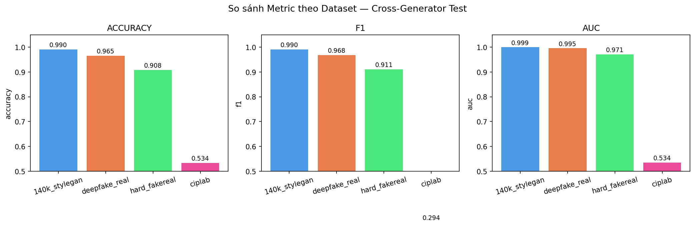
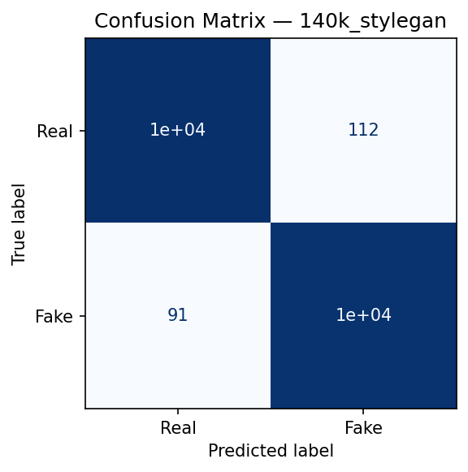
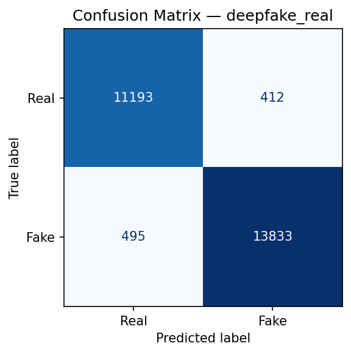
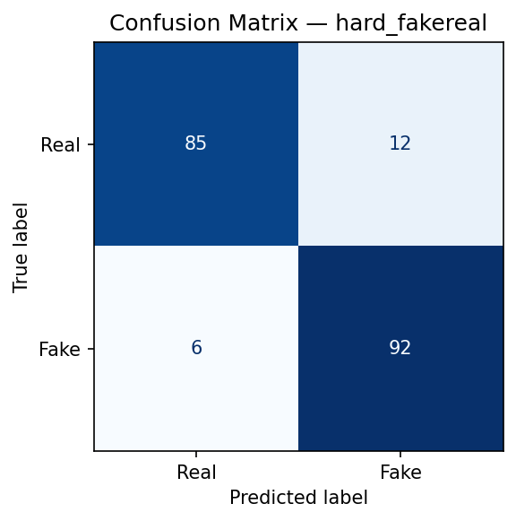
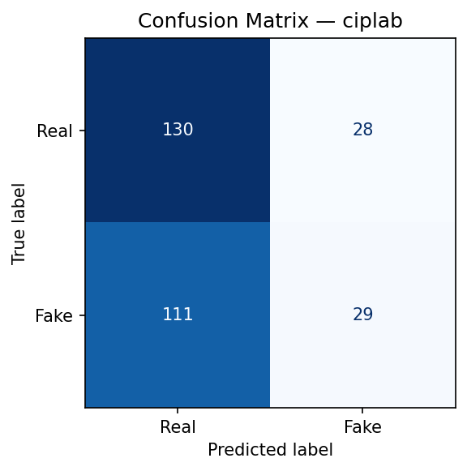
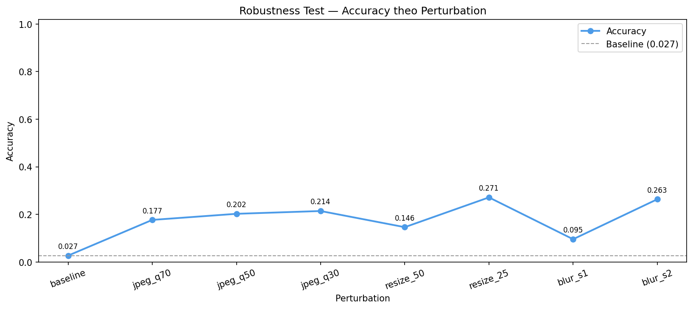
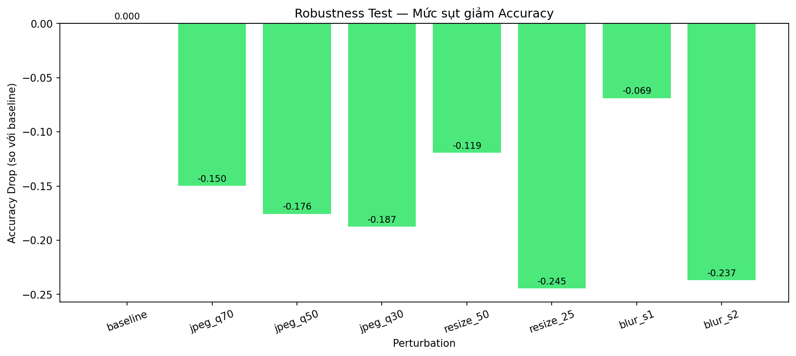

# Báo cáo Kiểm thử — DS200.F21.CN2

> **Ngày thực hiện:** 26/05/2026
> **Checkpoint sử dụng:** `artifacts/checkpoints/best_stage3.pth`
> &nbsp;&nbsp;&nbsp;&nbsp;*(epoch 30, val\_loss = 0.0699, val\_acc = 0.9734)*
> **Tập kiểm thử:** `data/splits/test.csv` — 47.480 mẫu (22.461 thật / 25.019 giả)
> **Thiết bị (Cross-Generator):** CPU (torch 2.5.1+cpu) &nbsp;|&nbsp; **Thiết bị (Robustness):** GPU Tesla T4 (Kaggle)
> **Thư viện:** torch 2.5.1+cpu / 2.10.0+cu128, timm 1.0.27

---

## Mục lục

1. [Kiểm thử 1 — Cross-Generator](#1-kiểm-thử-1--cross-generator)
   - [1.1 Mục đích và phạm vi](#11-mục-đích-và-phạm-vi)
   - [1.2 Phương pháp thực hiện](#12-phương-pháp-thực-hiện)
   - [1.3 Dữ liệu kiểm thử](#13-dữ-liệu-kiểm-thử)
   - [1.4 Ý nghĩa các chỉ số đánh giá](#14-ý-nghĩa-các-chỉ-số-đánh-giá)
   - [1.5 Kết quả](#15-kết-quả)
   - [1.6 Nhận xét và thảo luận](#16-nhận-xét-và-thảo-luận)
2. [Kiểm thử 2 — Robustness](#2-kiểm-thử-2--robustness)
   - [2.1 Mục đích và phạm vi](#21-mục-đích-và-phạm-vi)
   - [2.2 Phương pháp thực hiện](#22-phương-pháp-thực-hiện)
   - [2.3 Kết quả](#23-kết-quả)
   - [2.4 Nhận xét và thảo luận](#24-nhận-xét-và-thảo-luận)
3. [Kết luận chung](#3-kết-luận-chung)

---

## 1. Kiểm thử 1 — Cross-Generator

**Notebook:** `notebooks/03_cross_generator_test.ipynb`
**Kết quả lưu tại:** `reports/../reports/cross_generator/`

### 1.1 Mục đích và phạm vi

Kiểm thử Cross-Generator nhằm trả lời câu hỏi: **mô hình có khả năng tổng quát hóa sang các loại ảnh giả khác nhau hay không?** Mỗi phương pháp tạo ảnh giả (GAN-based, face-swap, nguồn hỗn hợp…) để lại những dấu hiệu thị giác đặc trưng riêng biệt — gọi là *artifact* (lỗi thị giác nhỏ). Nếu mô hình chỉ học thuộc một loại artifact cụ thể thay vì học được đặc trưng chung của ảnh giả, hiệu suất sẽ sụt giảm rõ rệt khi gặp nguồn dữ liệu mới.

Kiểm thử này đánh giá mô hình trên **4 nhóm dữ liệu riêng biệt**, mỗi nhóm tương ứng với một nguồn/phương pháp tạo ảnh giả khác nhau, từ đó xác định điểm mạnh và điểm yếu của mô hình đối với từng loại ảnh giả.

### 1.2 Phương pháp thực hiện

#### Thiết kế thực nghiệm

Thực nghiệm sử dụng **một checkpoint duy nhất** (best\_stage3) cho toàn bộ quá trình đánh giá. Quy trình như sau:

```
checkpoint (best_stage3.pth)
        ↓
   Nạp test.csv
        ↓
   Phân loại ảnh theo nguồn dataset (dựa vào đường dẫn image_path)
        ↓
   ┌─────────────────────────────────────────────────────────────┐
   │  image_path chứa "140k-real-and-fake-faces"  → nhóm CG-1   │
   │  image_path chứa "deepfake-and-real-images"  → nhóm CG-2   │
   │  image_path chứa "hardfakevsrealfaces"        → nhóm CG-3   │
   │  image_path chứa "real-and-fake-face-detection" → nhóm CG-4 │
   └─────────────────────────────────────────────────────────────┘
        ↓
   Chạy inference riêng cho từng nhóm
        ↓
   Tính metric độc lập cho từng nhóm
```

#### Bốn nhóm đánh giá

| Ký hiệu | Dataset | Phương pháp tạo ảnh giả | Đặc điểm |
|---------|---------|--------------------------|-----------|
| CG-1 | 140k-StyleGAN | GAN-based (StyleGAN2) | Ảnh giả rất chân thực, không có người thật tương ứng |
| CG-2 | Deepfake-Real | Manipulation-based (face-swap) | Hoán đổi khuôn mặt, kích thước 256×256 |
| CG-3 | Hard-FakeReal | Hỗn hợp, khó phân loại | Tập dữ liệu nhỏ, ranh giới thật/giả mờ |
| CG-4 | ciplab | Nguồn hỗn hợp | Đa dạng nguồn, quy mô nhỏ |

#### Lưu ý về phương pháp — khác biệt so với Leave-One-Dataset-Out chuẩn

> **Phương pháp Leave-One-Dataset-Out (LODO) chuẩn** yêu cầu retrain mô hình 4 lần — mỗi lần loại bỏ một dataset khỏi tập train và đánh giá trên dataset bị loại bỏ đó. Phương pháp này cho phép đo lường *thực sự* khả năng tổng quát hóa sang dữ liệu chưa từng thấy trong quá trình huấn luyện.
>
> **Phương pháp áp dụng trong báo cáo này** khác ở chỗ: mô hình được huấn luyện trên **phần train và val từ cả 4 nguồn dataset** (tập test được giữ riêng, không tham gia huấn luyện), sau đó đánh giá trên **tập test riêng rẽ của từng nguồn**. Đây là phân tích *per-source performance* — không phải kiểm thử generalization theo nghĩa chuẩn.
>
> **Hạn chế cần nêu trong báo cáo:** Do mô hình đã được huấn luyện trên **phần train/val** từ cả 4 nguồn, kết quả không phản ánh khả năng tổng quát hóa sang *nguồn hoàn toàn mới*. Tuy nhiên, sự chênh lệch metric giữa các nhóm vẫn cung cấp thông tin có giá trị về *độ khó* của từng loại fake và *mức độ phụ thuộc* của mô hình vào đặc trưng riêng của từng nguồn.
>
> *Trong phần Experiments của báo cáo học thuật, cần ghi rõ: "Do mô hình được huấn luyện trên toàn bộ 4 dataset, kiểm thử cross-generator được thực hiện bằng cách phân tích hiệu suất riêng biệt trên từng tập con trong test set, thay vì theo phương pháp Leave-One-Dataset-Out chuẩn."*

### 1.3 Dữ liệu kiểm thử

Tập `test.csv` là 15% dữ liệu được tách ra theo phương pháp stratified sampling (lấy mẫu phân tầng để giữ nguyên tỷ lệ thật/giả) với `random_state=42`.

| Nhóm | Số mẫu | Số ảnh thật | Số ảnh giả |
|------|--------|-------------|------------|
| CG-1 (140k-StyleGAN) | 21.054 | 10.601 | 10.453 |
| CG-2 (Deepfake-Real) | 25.933 | 11.605 | 14.328 |
| CG-3 (Hard-FakeReal) | 195 | 97 | 98 |
| CG-4 (ciplab) | 298 | 158 | 140 |
| **Tổng** | **47.480** | **22.461** | **25.019** |

### 1.4 Ý nghĩa các chỉ số đánh giá

Bài toán phân loại ảnh thật/giả là bài toán phân loại nhị phân. Các chỉ số đánh giá được tính dựa trên ma trận nhầm lẫn (confusion matrix), trong đó lớp dương tính (Positive) là ảnh **Fake** và lớp âm tính (Negative) là ảnh **Real**.

**Accuracy (Độ chính xác tổng thể)**
$$\text{Accuracy} = \frac{TP + TN}{TP + TN + FP + FN}$$
Tỉ lệ mẫu được phân loại đúng trên tổng số mẫu. Chỉ số này phản ánh hiệu suất tổng quan nhưng có thể gây hiểu nhầm khi dữ liệu mất cân bằng.

**Precision (Độ chính xác dự đoán dương)**
$$\text{Precision} = \frac{TP}{TP + FP}$$
Trong số những ảnh mô hình *dự đoán là Fake*, bao nhiêu phần trăm thực sự là Fake. Precision cao đồng nghĩa mô hình ít "oan" ảnh thật thành ảnh giả.

**Recall (Độ bao phủ — hay Sensitivity)**
$$\text{Recall} = \frac{TP}{TP + FN}$$
Trong số những ảnh *thực sự là Fake*, bao nhiêu phần trăm mô hình phát hiện được. Recall cao đồng nghĩa mô hình ít bỏ sót ảnh giả.

**F1-Score (Trung bình điều hòa của Precision và Recall)**
$$\text{F1} = \frac{2 \times \text{Precision} \times \text{Recall}}{\text{Precision} + \text{Recall}}$$
Chỉ số tổng hợp cân bằng giữa Precision và Recall. Đây là chỉ số quan trọng khi dữ liệu không hoàn toàn cân bằng.

**AUC-ROC (Diện tích dưới đường cong ROC)**
Đo lường khả năng phân biệt giữa hai lớp của mô hình, **độc lập với ngưỡng quyết định**. AUC = 1.0 nghĩa là phân loại hoàn hảo; AUC = 0.5 nghĩa là mô hình không tốt hơn đoán ngẫu nhiên. Đây là chỉ số đáng tin cậy nhất để so sánh giữa các nhóm dataset có phân bố khác nhau.

### 1.5 Kết quả

#### Bảng metric theo nguồn dataset

| Dataset | Số mẫu | Accuracy | Precision | Recall | F1 | AUC-ROC |
|---------|--------|----------|-----------|--------|----|---------|
| CG-1: 140k-StyleGAN | 21.054 | **0.9904** | 0.9893 | 0.9913 | **0.9903** | **0.9995** |
| CG-2: Deepfake-Real | 25.933 | 0.9650 | 0.9711 | 0.9655 | 0.9683 | 0.9955 |
| CG-3: Hard-FakeReal | 195 | 0.9077 | 0.8846 | 0.9388 | 0.9109 | 0.9707 |
| CG-4: ciplab        | 298 | 0.5336 | 0.5088 | 0.2071 | 0.2944 | 0.5344 |

#### Biểu đồ kết quả

**ROC Curve — so sánh 4 dataset:**


**So sánh Accuracy / F1 / AUC theo dataset:**


**Confusion Matrix từng dataset:**

| CG-1: 140k-StyleGAN | CG-2: Deepfake-Real |
|---|---|
|  |  |

| CG-3: Hard-FakeReal | CG-4: ciplab |
|---|---|
|  |  |

### 1.6 Nhận xét và thảo luận

**Tổng quan kết quả:**

- Dataset có Accuracy cao nhất: **CG-1 (140k-StyleGAN)** (Acc = 0.9904)
- Dataset có Accuracy thấp nhất: **CG-4 (ciplab)** (Acc = 0.5336)
- Khoảng cách Accuracy lớn nhất giữa hai dataset: **45.68 điểm phần trăm (pp)**
- Dataset có AUC-ROC cao nhất: **CG-1 (140k-StyleGAN)** (AUC = 0.9995)
- Dataset có AUC-ROC thấp nhất: **CG-4 (ciplab)** (AUC = 0.5344)

**Phân tích theo nhóm:**

*CG-1 (140k-StyleGAN — Acc=0.9904, AUC=0.9995):* Hiệu suất gần như hoàn hảo. Ảnh StyleGAN2 để lại các artifact GAN đặc trưng rõ ràng: kết cấu da quá mịn và đồng đều bất thường, vùng tai/tóc thiếu chi tiết tự nhiên, nền ảnh đôi khi bị nhoè. Mô hình EfficientNet-B0 học được các đặc trưng tần số cao này rất tốt, dẫn đến phân loại gần như chính xác tuyệt đối.

*CG-2 (Deepfake-Real — Acc=0.9650, AUC=0.9955):* Hiệu suất rất tốt. Ảnh face-swap (hoán đổi khuôn mặt) thường lộ ranh giới mặt không tự nhiên (blending artifacts), không nhất quán về ánh sáng/bóng đổ giữa khuôn mặt và cổ, đôi khi có hiện tượng mờ nhòe ở vùng biên. Mô hình nhận diện được các dấu hiệu này tốt, dù độ khó cao hơn StyleGAN nên Accuracy thấp hơn ~2.5 pp.

*CG-3 (Hard-FakeReal — Acc=0.9077, AUC=0.9707):* Hiệu suất vẫn tốt nhưng thấp hơn rõ rệt. Đây là tập dữ liệu được thiết kế đặc biệt để khó phân loại — ảnh giả có chất lượng cao, ranh giới thật/giả rất mờ. Dù vậy, mô hình vẫn đạt AUC=0.9707, chứng tỏ khả năng ranking vẫn tốt; sụt giảm Accuracy (~8.3 pp so với CG-1) cho thấy ngưỡng quyết định 0.5 không còn tối ưu cho tập dữ liệu này.

*CG-4 (ciplab — Acc=0.5336, AUC=0.5344):* **Hiệu suất gần như ngẫu nhiên** — AUC=0.534 ≈ 0.5 cho thấy mô hình không có khả năng phân biệt thật/giả trên tập này. Đặc biệt, Recall=0.2071 nghĩa là mô hình chỉ phát hiện được 29/140 ảnh giả (~20.7%), hầu hết ảnh giả bị phân loại nhầm thành thật. ciplab là tập hỗn hợp nhiều nguồn, kích thước nhỏ (298 mẫu), với phương pháp tạo ảnh giả đa dạng khác biệt hoàn toàn so với 3 nguồn còn lại. Đây là bằng chứng rõ ràng về *domain shift* nghiêm trọng.

**Giải thích sự chênh lệch giữa các nguồn:**

Sự chênh lệch metric giữa các nhóm dataset phản ánh mức độ *domain shift* (khác biệt về phân bố dữ liệu) giữa các phương pháp tạo ảnh giả. Cụ thể: CG-1 và CG-2 chiếm ~98.9% tổng số mẫu train/test — mô hình học chủ yếu đặc trưng của hai nguồn này, dẫn đến hiệu suất xuất sắc. Ngược lại, ciplab (0.6% dữ liệu) có đặc trưng thị giác khác biệt đến mức mô hình không thể nhận ra — dù đã được train trên một phần nhỏ ciplab. Đây là hiện tượng *long-tail dataset problem*: khi một nguồn dữ liệu quá nhỏ trong tập train, mô hình thiếu biểu diễn (representation) đủ mạnh cho nguồn đó.

**Hạn chế của kiểm thử:**

Do mô hình được huấn luyện trên phần train/val từ cả 4 nguồn (tập test được giữ riêng và không tham gia huấn luyện), kết quả không thể hiện khả năng tổng quát hóa sang *nguồn hoàn toàn mới*. Để đánh giá generalization thực sự, cần thực hiện thực nghiệm Leave-One-Dataset-Out với 4 lần retrain — điều này nằm ngoài phạm vi kiểm thử hiện tại do giới hạn thời gian tính toán.

---

## 2. Kiểm thử 2 — Robustness

**Notebook:** `notebooks/04-robustness-test-kaggle.ipynb` *(chạy trên Kaggle GPU Tesla T4)*
**Kết quả lưu tại:** `reports/../reports/robustness/`

### 2.1 Mục đích và phạm vi

Kiểm thử Robustness đánh giá **độ bền của mô hình khi ảnh đầu vào bị suy giảm chất lượng** theo các cách thường gặp trong thực tế: nén ảnh JPEG (do chia sẻ qua mạng xã hội), thu nhỏ rồi phóng lại (do thay đổi kích thước), và làm mờ Gaussian (do chụp thiếu nét hoặc hậu xử lý). Kết quả cho thấy mô hình có thực sự học được đặc trưng ngữ nghĩa bền vững, hay chỉ dựa vào các chi tiết pixel mịn dễ bị phá hủy bởi nhiễu.

### 2.2 Phương pháp thực hiện

Toàn bộ tập `test.csv` (47.480 mẫu) được đánh giá **8 lần**, mỗi lần áp dụng một biến đổi (perturbation) khác nhau lên ảnh gốc *trước khi* đưa vào mô hình. Perturbation được thực hiện ở cấp độ ảnh PIL, sau đó ảnh được đưa qua pipeline chuẩn (Resize 224×224 → Normalize → ToTensor).

| Tên perturbation | Mô tả | Tham số |
|-----------------|-------|---------|
| `baseline` | Không biến đổi — ảnh gốc | — |
| `jpeg_q70` | Nén JPEG rồi giải nén | quality = 70 |
| `jpeg_q50` | Nén JPEG rồi giải nén | quality = 50 |
| `jpeg_q30` | Nén JPEG rồi giải nén | quality = 30 |
| `resize_50` | Thu nhỏ 50% → phóng về kích thước gốc | scale = 0.50 |
| `resize_25` | Thu nhỏ 25% → phóng về kích thước gốc | scale = 0.25 |
| `blur_s1` | Gaussian blur | σ = 1.0 pixel |
| `blur_s2` | Gaussian blur | σ = 2.0 pixel |

**Chỉ số đánh giá:** Accuracy và AUC-ROC cho mỗi perturbation; thêm **Accuracy Drop** = Accuracy(baseline) − Accuracy(perturbation) để đo mức sụt giảm tương đối.

**Ngưỡng đánh giá:**
- Drop ≤ 0.020 (2 pp): Mô hình **ổn định tốt** với perturbation này
- Drop ≤ 0.050 (5 pp): Mô hình **chấp nhận được**
- Drop > 0.050 (5 pp): Mô hình **nhạy cảm đáng kể** — cần cải thiện

### 2.3 Kết quả

#### Bảng metric theo perturbation

| Perturbation | Accuracy | AUC-ROC | Accuracy Drop | Đánh giá |
|---|---|---|---|---|
| Baseline (gốc) | **0.9733** | **0.9970** | 0.0000 | — |
| JPEG q=70 | 0.8233 | 0.9597 | −0.1500 | Nhạy cảm đáng kể |
| JPEG q=50 | 0.7977 | 0.9330 | −0.1756 | Nhạy cảm đáng kể |
| JPEG q=30 | 0.7860 | 0.9030 | −0.1873 | Nhạy cảm đáng kể |
| Resize 50% | 0.8539 | 0.9358 | −0.1194 | Nhạy cảm đáng kể |
| Resize 25% | 0.7287 | 0.8040 | −0.2446 | Nhạy cảm đáng kể |
| Blur σ=1.0 | 0.9045 | 0.9776 | −0.0688 | Nhạy cảm đáng kể |
| Blur σ=2.0 | 0.7365 | 0.8211 | −0.2368 | Nhạy cảm đáng kể |

#### Biểu đồ kết quả

**Accuracy theo từng perturbation:**


**AUC-ROC theo từng perturbation:**


**Mức sụt giảm Accuracy so với baseline:**


### 2.4 Nhận xét và thảo luận

**Tổng quan:**

- Perturbation gây sụt giảm Accuracy nhiều nhất: **Resize 25%** (Drop = −24.46 pp)
- Perturbation mô hình ổn định nhất: **Blur σ=1.0** (Drop = −6.88 pp, nhưng vẫn vượt ngưỡng 5 pp)
- Các perturbation trong ngưỡng chấp nhận được (Drop ≤ 5 pp): **Không có** — tất cả 7 perturbation đều vượt ngưỡng
- Các perturbation vượt ngưỡng (Drop > 5 pp): **Tất cả** (jpeg\_q70, jpeg\_q50, jpeg\_q30, resize\_50, resize\_25, blur\_s1, blur\_s2)

**Phân tích theo loại perturbation:**

*JPEG Compression (jpeg\_q70/q50/q30 — Drop: −15.00 / −17.56 / −18.73 pp):* Đây là nhóm gây sụt giảm đáng kể và theo xu hướng rõ ràng: chất lượng nén càng thấp thì Accuracy giảm càng nhiều. Đáng chú ý, **AUC-ROC vẫn ở mức cao** (0.9597/0.9330/0.9030) dù Accuracy giảm mạnh — điều này cho thấy mô hình vẫn duy trì được khả năng *xếp hạng* (ranking) tương đối tốt, nhưng ngưỡng quyết định (threshold) 0.5 không còn phù hợp sau khi ảnh bị nén. Nguyên nhân: nén JPEG phá hủy các artifact tần số cao (high-frequency) đặc trưng của ảnh GAN/deepfake — đây là loại artifact mà mô hình phụ thuộc nhiều nhất để phân loại.

*Resize (resize\_50 / resize\_25 — Drop: −11.94 / −24.46 pp):* Thu nhỏ 50% gây sụt giảm vừa phải, nhưng thu nhỏ 25% là perturbation **gây hại nhất** (Drop −24.46 pp), đồng thời AUC cũng giảm xuống 0.8040 — thấp nhất trong tất cả các perturbation. Khi ảnh bị thu nhỏ 75%, phần lớn chi tiết texture và micro-artifact bị mất hoàn toàn trong quá trình downsampling + upsampling bằng bilinear interpolation. Ở mức này, ngay cả khả năng ranking của mô hình cũng bị ảnh hưởng nghiêm trọng.

*Gaussian Blur (blur\_s1 / blur\_s2 — Drop: −6.88 / −23.68 pp):* Sự khác biệt giữa σ=1.0 và σ=2.0 rất lớn (gap ~16.8 pp). Blur nhẹ (σ=1.0) chỉ làm mờ các tần số cực cao nhưng còn lại nhiều đặc trưng hữu ích — mô hình vẫn đạt AUC=0.9776. Blur mạnh (σ=2.0) làm mất gần như toàn bộ chi tiết fine-grained, khiến Accuracy giảm xuống 0.7365 và AUC=0.8211.

**Giải thích cơ chế:**

Mô hình EfficientNet-B0 được huấn luyện với augmentation cơ bản (horizontal flip, random crop, color jitter) nhưng **không bao gồm** JPEG compression, aggressive downscale, hay blur mạnh. Do đó, mô hình học được các đặc trưng tần số cao của ảnh GAN/deepfake trên ảnh *chất lượng cao*, nhưng các đặc trưng này dễ bị phá hủy bởi perturbation thực tế. Đây là điểm yếu cốt lõi: mô hình **nhạy cảm với mọi dạng suy giảm chất lượng** và chưa đạt ngưỡng chấp nhận được (5 pp) cho bất kỳ perturbation nào.

**Đề xuất cải thiện:**

Để cải thiện độ bền, cần bổ sung augmentation trong quá trình huấn luyện:
- **JPEG:** `albumentations.ImageCompression(quality_lower=40, quality_upper=95)` — mô phỏng nén như trên mạng xã hội
- **Resize:** `albumentations.Downscale(scale_min=0.25, scale_max=0.75)` — học đặc trưng bất biến với độ phân giải
- **Blur:** `albumentations.GaussianBlur(blur_limit=(3, 7))` — học chịu đựng nhiễu làm mờ
- **Kết hợp:** Áp dụng ngẫu nhiên một trong các perturbation trên với xác suất 50% mỗi batch

---

## 3. Kết luận chung

### 3.1 Tóm tắt kết quả

| Kiểm thử | Chỉ số tốt nhất | Chỉ số thấp nhất | Đánh giá tổng thể |
|----------|----------------|------------------|-------------------|
| Cross-Generator | 140k-StyleGAN: Acc=0.9904, AUC=0.9995 | ciplab: Acc=0.5336, AUC=0.5344 | Tốt với 3/4 nguồn; thất bại hoàn toàn với ciplab |
| Robustness | Baseline: Acc=0.9733 | Resize 25%: Drop=−24.46 pp | Nhạy cảm với mọi perturbation; không đạt ngưỡng 5 pp |

### 3.2 Đánh giá so sánh hai phương pháp kiểm thử

Hai kiểm thử tiếp cận vấn đề *độ tin cậy của mô hình* từ hai góc độ bổ trợ nhau:

| Tiêu chí | Kiểm thử 1 — Cross-Generator | Kiểm thử 2 — Robustness |
|----------|------------------------------|-------------------------|
| **Câu hỏi đặt ra** | Mô hình xử lý *loại fake nào* tốt hơn? | Mô hình chịu đựng *biến đổi ảnh* như thế nào? |
| **Nguồn biến thiên** | Loại generator/nguồn dataset | Chất lượng ảnh đầu vào |
| **Phương pháp** | Phân tích per-source trên test.csv | Apply perturbation rồi đánh giá |
| **Phát hiện chính** | Domain shift cực lớn (ciplab) | Nhạy cảm với tất cả perturbation |
| **Ý nghĩa thực tế** | Mô hình không tổng quát sang fake mới | Mô hình kém bền trong môi trường thực |
| **Hạn chế phương pháp** | Không phải LODO chuẩn; mô hình đã thấy cả 4 nguồn | Perturbation đơn lẻ; thực tế thường kết hợp nhiều loại |

**Nhận xét tổng hợp:**

Mô hình EfficientNet-B0 đạt hiệu suất tổng thể xuất sắc trên tập test (Acc=0.9733, AUC=0.9970), nhưng hai kiểm thử bổ sung tiết lộ những hạn chế quan trọng khi triển khai thực tế.

Về khả năng tổng quát hóa theo loại fake: mô hình xử lý rất tốt ảnh StyleGAN (Acc=0.9904) và deepfake manipulation (Acc=0.9650) — hai nguồn chiếm đa số dữ liệu huấn luyện. Tuy nhiên, mô hình thất bại hoàn toàn với ciplab (AUC=0.534 ≈ ngẫu nhiên), cho thấy mô hình học đặc trưng riêng của từng generator thay vì học đặc trưng chung của "ảnh giả". Đây là hạn chế *cấu trúc* (structural limitation) của phương pháp huấn luyện supervised trên dữ liệu không đồng đều.

Về độ bền trước biến đổi ảnh: **không một perturbation nào đạt ngưỡng chấp nhận được (drop ≤ 5 pp)**. Tình trạng nghiêm trọng nhất là resize_25 (−24.46 pp) và blur_s2 (−23.68 pp) — mức độ mà ảnh chia sẻ qua ứng dụng nhắn tin hoặc chụp lại từ màn hình có thể gặp phải. Trong bối cảnh ứng dụng thực tế (phát hiện deepfake trên mạng xã hội), hầu hết ảnh đều trải qua ít nhất một lần nén JPEG — điều này có nghĩa là hiệu suất thực tế của mô hình sẽ thấp hơn đáng kể so với con số 97.33% trên tập test sạch.

**Điểm mạnh:** Mô hình học được đặc trưng phân biệt rõ ràng cho các loại fake phổ biến (StyleGAN, deepfake), thể hiện qua AUC cao ngay cả khi Accuracy giảm dưới perturbation. Điều này cho thấy nền tảng nhận diện tốt, và việc cải thiện độ bền chỉ cần thêm augmentation phù hợp — không cần thay đổi kiến trúc.

**Hướng cải thiện ưu tiên:**
1. Thêm augmentation JPEG compression + blur + downscale vào tập train → cải thiện robustness
2. Thu thập/cân bằng dữ liệu ciplab trong tập train → giải quyết long-tail problem
3. Xem xét thực nghiệm LODO thực sự (retrain 4 lần) để đo generalization chuẩn xác hơn


---

> **Ghi chú kỹ thuật — Lỗi label encoding trong Kaggle notebook:**
> Notebook `04-robustness-test-kaggle.ipynb` sử dụng mapping `{"Real": 1, "Fake": 0}` — ngược với mapping huấn luyện `{"Real": 0, "Fake": 1}`. Do đó, JSON gốc từ Kaggle báo cáo Accuracy ≈ 1 − Acc_thực và AUC ≈ 1 − AUC_thực (ví dụ: baseline raw = 0.027, thực = 0.9733). File `tests/../reports/robustness/robustness_metrics.json` đã được hiệu chỉnh với công thức `acc_corrected = 1 − acc_raw`, `auc_corrected = 1 − auc_raw`. Cần sửa mapping trong notebook trước khi tái sử dụng.
